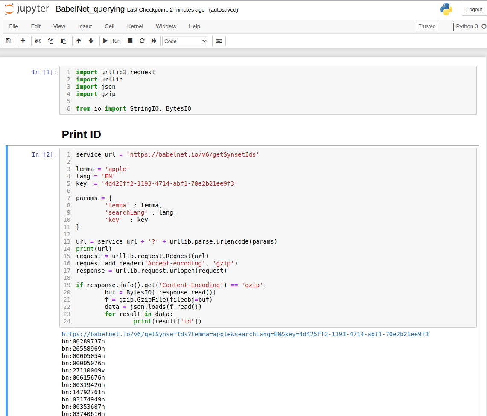
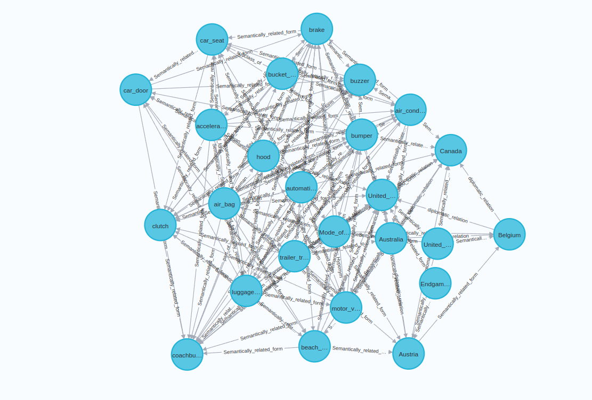

# Summary about the project

<!-- TABLE OF CONTENTS -->

  
Table of Contents

  <ol>
    <li><a href="#what-is-babelnet?">What is BabelNet?</a></li>
    <li>
      <a href="#getting-started">Getting Started</a>
      <ul>
        <li><a href="#prerequisites">Prerequisites</a></li>
        <li><a href="#installation">Installation</a></li>
        <li><a href="#execution">Execution</a></li>
      </ul>
    </li>
    <li><a href="#why-babelnet?">Why BabelNet?</a></li>
  </ol>

<!-- What is BabelNet? -->
## What is BabelNet?
[BabelNet](https://babelnet.org/) is a multilingual lexicalized semantic network and ontology. It was automatically created by linking the largest multilingual Web encyclopedia – i.e. Wikipedia to the most popular computational lexicon of the English language – i.e. WordNet. It contains an API for programmatic access of 5.5 million concepts and
a multilingual knowledge-rich Word Sense Disambiguation (WSD). With the aid of this API, we can extract all possible concepts in a piece of text. BabelNet offers HTTP and Java API as well as the RDF and SPARQL endpoints. Mostly the BabbelNet is operated using a JAVA API compared to other API. One can find the Babbelnet API guide in the official website. Multilingual text analytics to get the gist of any text, you can copy paste the content of any language it can translate and give you the meaning in the preferred language.

(<a href="#top">back to top</a>)

<!-- GETTING STARTED -->
## Getting Started

1. Register in [Babelnet](https://babelnet.org/register)

2. Babelcoin: Used as an internal credit system to keep track of the request
made against API
– 1 Babelcoin = 1 Query to BabelNet
– Base account-1000 Babelcoins/day

3. For research and non-commercial usage Babel indices can be downloaded upon submitting the request form describing the indented use.

4. The API available in open source is HTTP and JAVA API

5. The key should be append each time making query using HTTP.

6. Since it is HTTP, it can be code from Python too as show below

7. Refer "BabelNet_querying_practice.ipynb" file to understand the basic querying.

(<a href="#top">back to top</a>)

<!-- Why Babelnet? -->
## Why Babelnet?

The knowledge from the babelnet can be used to enrich with the knowledge we presently have as a graph. Example the knowledge Babelnet contains from wiki, wordnet can
be merged with the knowledge we acquired from dcouments, website by scrapping or as in graph. So this project includes querying Babelnet for the term "Automative safety" and associated linkages with it to Neo4j. This can be further used to merge with the other knowledge/knowledge graph we may acquire. 

The above graph represents the queried nodes along with their relationship using HTTP via python code from Babelnet to Neo4j

(<a href="#top">back to top</a>)

